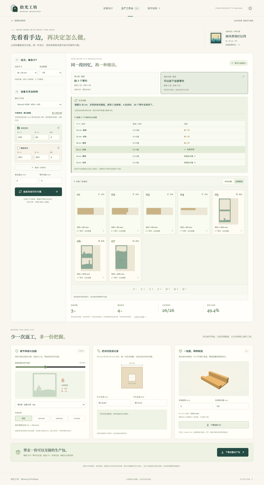
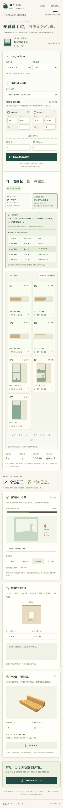

# 拾光工坊 · Memory Workshop

**一段回忆 → AI 场景设计 → 手边材料里的可行方案 → 可交接的制作文件。**

Falcon AI Agent 黑客松 · MakerMuse 场景赛道  
宫保鸡丁队｜队长：彭然君｜队员：杨睿

拾光工坊面向纪念礼物创作者与定制礼品小店。它把个人故事变成六层光影盒，再根据有限库存、激光工作区和制作数量，比较整框与拼条结构，让余料也能成为礼物。v2 由“拾光剧场”升级，保留原有故事设计入口，新增生产工作台。

## 评审入口

- **[直接打开在线体验版](https://davidpengrj.github.io/memory-workshop/)**：无需登录，可切换示例、调整作品、查看三维、排版与下载。自定义 AI 故事请使用本地版，详见[两种体验方式](docs/在线体验与本地运行.md)。
- [下载 v2.1 源码与完整材料](https://github.com/davidpengrj/memory-workshop/releases/tag/v2.1.0)
- [演示视频 · 3 分 25 秒](https://github.com/davidpengrj/memory-workshop/releases/download/v2.1.0/memory-workshop-demo.mp4)
- [作品说明 PDF](https://github.com/davidpengrj/memory-workshop/releases/download/v2.1.0/memory-workshop-introduction.pdf)
- [开发过程记录 · 单个 Markdown](https://github.com/davidpengrj/memory-workshop/releases/download/v2.1.0/memory-workshop-development.md)



<details>
<summary>查看手机界面</summary>



</details>

## v2.1 体验优化

自动保存当前方案和未生成的故事草稿，刷新后继续；一屏查看全部板材；展开候选对比并主动选择其他可行方案。三维预览静止或离开视口时停止绘制，交互时恢复。已有制作文件格式保持兼容。具体记录见 [体验优化说明](docs/体验优化说明.md)。

## 本地启动

需要 Node.js 22 或以上版本（本机验证版本：22.20.0）。仓库和源码包均附当前构建产物 `dist`，**直接演示无需重新安装依赖**：从上方 Release 下载源码，或克隆仓库；Mac 双击项目内的 `启动.command`，也可在项目目录运行：

```sh
node server/index.mjs
```

修改代码后，重新安装依赖并构建，再启动服务：

```sh
npm ci
npm run build
npm start
```

打开[故事设计](http://127.0.0.1:4177)或[生产工作台](http://127.0.0.1:4177/#production)。服务只监听本机；这两个地址不能作为评委远程访问链接。

- **示例体验**：三份预置故事，无需账号或模型，可完成预览、库存排版与文件导出。
- **真实 AI**：需要已安装并登录的 Kiro CLI（本机验证版本：2.22.0）。运行 `kiro-cli whoami` 确认登录，输入故事后调用该账号的 Kiro 额度。失败会明确报错，保留原作品，不会用示例冒充生成结果。

## 建议演示路径

1. 在故事设计中旋转、展开六层场景，查看 AI 设计理由。
2. 进入生产工作台，选择 18 cm、1 件，载入余料示例，使用 Falcon2 工作区、4 mm 板边留白、3 mm 件间距。
3. 比较整框和拼条，点击“按库存找可行方案”；再将数量改为 2 件，观察尺寸随库存调整。
4. 查看细节风险，尝试轮廓加固；试切后填入实测值与板厚，查看切缝估计和底座槽宽。
5. 下载生产包，先打开 `生产交接单.html`，再检查板级 SVG、零件定位表和底座 STL。

演示库存为 4 张 300 × 80 mm 余料、4 张 300 × 400 mm 新板，工作区 400 × 415 mm。

|同一库存下的方案|软件排版结果|
|---|---|
|18 cm × 1 件，整框|11 个零件中排下 8 个，缺 3 个|
|18 cm × 1 件，拼条|26 个零件全部排下，使用 3 张新板、4 张余料|
|数量改为 2 件并寻找方案|选择 14 cm 拼条，52 个零件全部排下|

这些是可复现的示例计算，尚未测得实际成本或工时收益。拼条增加了胶粘定位步骤。

## 已实现功能

- **故事设计**：真实 Kiro JSON 规划；四类场景、十二种意象、四组配色；六层同源三维/SVG；旋转、分层、单层检查和保存恢复。
- **材料反向设计**：14 / 18 / 22 cm、1–6 件同款；有限库存、余料标记、Falcon2 / Falcon A1 / 自定义工作区；整框与 20 根条拼成五个间隔框的比较。
- **可行方案选择**：在不大于当前尺寸的候选中，优先保留最大可行尺寸，再比较新板数与已用板面积。排版为确定性 MaxRects 矩形启发式，允许 90° 旋转，检查边界和件间距。
- **细节检查与修改**：高亮疑似过细区域和小孔；0 / 0.4 / 0.8 / 1.2 mm 轮廓加固同步改变预览与导出。
- **试切记录与配套底座**：30 mm 外片、10 mm 方孔双测量估算切缝；按板厚与装配余量生成可下载的 STL 展示底座。
- **生产交接**：ZIP 包含板级 SVG、`parts.csv` 零件/BOM 定位表、`job.json`、`stand.stl`、校准试片、效果图与装配交接单。存在未安排零件时不能导出完整生产包。

## 制作约定与当前边界

每件包含六层图案和五层间隔。整框模式共 11 件；拼条模式共 26 件，其中 20 根间隔条胶粘组成五个框。库存按同材、同厚、平整可切的矩形板处理。红色 CUT、蓝色 ENGRAVE 为加工路径，板边与界面编号不导出为切割线。

排版不保证全局最优，不在孔洞内套料；“矩形占地率”是零件包络占已用板面的比例，不是净材料利用率。细节检查使用轮廓内缩/回扩近似，忽略不超过 0.7 mm² 的变化；加固可能缩小或封闭小孔。切缝记录仅作估计，文件未自动补偿。

**尚未进行实体试切或打印。** 底座闭合网格已检查，实际配合与稳定性仍需试做。激光功率、速度、切片和机器操作由设备软件完成；项目没有连接或控制硬件。暖光为效果表达，灯具、外箱与电路另备。当前支持有界意象组合，不支持任意物体、人物肖像或任意图片建模。

## 技术结构

```text
src/main.jsx          故事设计与共享方案状态
src/geometry.js       场景多边形、结构检查、SVG
src/Scene.jsx         同源 Three.js 分层预览
src/Production.jsx    库存、候选方案与生产工作台
src/packing.js        有限库存 MaxRects 排版
src/contours.js        轮廓偏移与面积计算
src/preflight.js       细节风险与双测量切缝估计
src/stand.js           参数化底座与 STL
src/job-export.js      板级 SVG、CSV、JSON 与生产包
server/plan.mjs        Kiro 提示词、调用与 JSON 校验
server/index.mjs       本机接口、静态服务、并发与缓存
tests/                几何、排版、导出、规划与接口测试
docs/                 提交文案、技术说明与开发证据
```

运行时 Kiro Agent 禁用工具，仅输出受限 JSON；应用不执行模型提供的程序或 SVG。凭据由 Kiro CLI 管理，项目不保存密码或令牌。故事会发送给 Kiro，本机服务器不持久化，最近 12 份成功方案暂存在内存。保存的作品、自动草稿、库存设置和测量记录位于当前浏览器，清除站点数据可删除。此架构用于本机演示，公网服务需另行设计身份与额度管理。

## 验证与提交材料

```sh
npm test
npm run build
```

v2.1 已通过 **66 个自动化测试**，覆盖原有 288 组主题/意象/种子几何组合，以及有限库存、旋转、间距、加固、切缝估计、闭合 STL 和生产包内容。浏览器验证通过库存不足→拼条可行、批量尺寸选择、非法输入、实际下载、故事同步和手机布局。真实 Kiro 故事生成已验证；v2 录制成功生成“小院一直亮着灯”，调用未命中缓存。

开发由 Codex 与 Kiro CLI 协作，保留六轮 Kiro 开发记录，其中第三轮为只读复审。说明见 [作品简介](docs/作品简介.md)、[技术方案](docs/技术方案.md)、[商业价值与创新](docs/商业价值与创新.md)、[开发过程记录](docs/开发过程记录.md)和[提交前核对](docs/提交前核对.md)。第三方依赖与许可证见 [开源组件声明](docs/开源组件声明.md)。

提交使用 v2.1 最新源码包；3 分 25 秒视频记录 v2 核心流程；旧“拾光剧场”仅为历史记录。代码与演示材料通过 GitHub 提供，GitHub Pages 提供免登录示例体验，本地版支持真实 Kiro 生成。尚未代为提交赛事。
